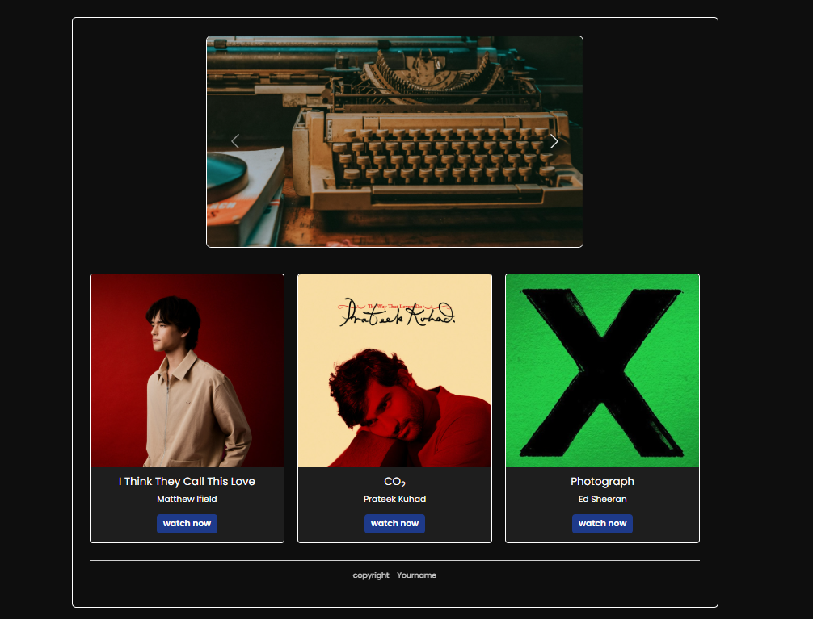

# Simple-Bootstrap-project

## 🚀 Features
- Clean and modern design using **Bootstrap** and **custom CSS**
- Responsive layout that works on all devices
- Interactive **carousel** to display background images
- Music cards with:
  - Song title
  - Artist name
  - "Watch Now" button linking to YouTube

## 🎵 Usage
1. Open the `index.html` file in any web browser.
2. Use the **carousel** at the top to view different slides.
3. Scroll down to explore **music cards**.
4. Click the **"watch now"** button on any card to open the song on YouTube in a new tab.

## Preview:  
 
  
